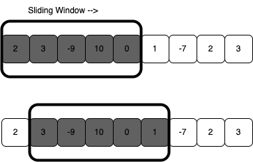

# Sliding Window

A pattern used when given an `array` or `linked list`. Used when we need to perform a required operation on a specific window size. 



# To identify the Sliding Window:
- Input is a linear data structure (array, linked list, or a string)
- Goal is to find the longest/shortest subarray, substring, or desired value

# Problems that can be solved using the Sliding Window:

<details>
<summary>
<span style="font-size:1.5rem;">Maximum sum subarray of size ‘K’ (easy)
</span>
</summary>

```js
function maxSumSubarray(arr, num) {
  // variables
  let maxSum = 0
  let maxTemporarySum = 0
  
  // edge cases
  if (arr.length < num) return null

  // first loop
  for (let i = 0; i < num; i++) {
    maxSum += arr[i]
  }

  // store the first sum
  maxTemporarySum = maxSum

  // second loop
  for (let i = num; i < arr.length; i++) {
    maxTemporarySum += - arr[i - num] + arr[i]
    maxSum = Math.max(maxSum, maxTemporarySum)
  }

  // return the max sum
  return maxSum
}

console.log(maxSumSubarray([1, 2, 5, 2, 8, 1, 5], 2)) // 10
console.log(maxSumSubarray([1, 2, 5, 2, 8, 1, 5], 4)) // 17
console.log(maxSumSubarray([4, 2, 1, 6], 1)) // 6
console.log(maxSumSubarray([4, 2, 1, 6, 2], 4)) // 13

// Time Complexity: O(n)
// Space Complexity: O(1)
```

</details>

 

<details>
<summary>
<span style="font-size:2rem; color:green;">Longest substring with ‘K’ distinct characters (<a href="https://leetcode.com/problems/longest-substring-with-at-most-k-distinct-characters/">medium</a>)</span>
</summary>

<details>
<summary  style="padding-left:1rem;">
<span style="font-size:1.5rem;">SETUP VARIABLES</span>
</summary>

```js
var lengthOfLongestSubstringKDistinct = function(s, k) {
  // SETUP VARIABLES
  let START = 0;
  const SOFAR = new Map();
  let MAX = 0;

```

</details>

<details>
<summary  style="padding-left:1rem;">
<span style="font-size:1.5rem;">FOR LOOP, rightCHAR</span>
</summary>

```js
  // ITERATE OVER s, our string, set END = 0
  for (let END = 0; END < s.length; END++){
    // pull out our rightCHAR
    let rightCHAR = s[END];

```

</details>

<details>
<summary  style="padding-left:1rem;">
<span style="font-size:1.5rem;">IF-ELSE</span>
</summary>

```js
    // if our Map does not contain the rightCHAR, then we want to set it to 1
    if(!SOFAR.get(rightCHAR)) SOFAR.set(rightCHAR, 1);
    // if it does contain the rightCHAR, then we want to increment it by 1
    else SOFAR.set(rightCHAR, SOFAR.get(rightCHAR) + 1);
```

</details>

<details>
<summary  style="padding-left:1rem;">
<span style="font-size:1.5rem;">WHILE, leftCHAR</span>
</summary>

```js
    while(SOFAR.size > k) {
      // so lets get our leftCHAR which = s[START]
      let leftCHAR = s[START];

```

</details>

<details>
<summary  style="padding-left:1rem;">
<span style="font-size:1.5rem;">IF ELSE, INCR START</span>
</summary>

```js
      //SO IF > 1 leftCHAR we want to decrement (or DELETE) followed by increment our window START
      if(SOFAR.get(leftCHAR) > 1) SOFAR.set(leftCHAR, SOFAR.get(leftCHAR) - 1);
      else SOFAR.delete(leftCHAR);

      START++;
    }
```

</details>

<details>
<summary  style="padding-left:1rem;">
<span style="font-size:1.5rem;">CALC MAX, RETURN</span>
</summary>

```js
    // calculate MAX using Math.max
    MAX = Math.max(MAX, (END - START) + 1)
  }
  // return MAX
  return MAX;
}
```

</details>

<details>
<summary  style="padding-left:1rem;">
<span style="font-size:1.5rem;">COMPLETE</span>
</summary>

```js
var lengthOfLongestSubstringKDistinct = function(s, k) {
  // SETUP VARIABLES
  let START = 0;
  const SOFAR = new Map();
  let MAX = 0;

  // ITERATE OVER s, our string, set END = 0
  for (let END = 0; END < s.length; END++){
    // pull out our rightCHAR
    let rightCHAR = s[END];

    // if our Map does not contain the rightCHAR, then we want to set it to 1
    if(!SOFAR.get(rightCHAR)) SOFAR.set(rightCHAR, 1);
    // if it does contain the rightCHAR, then we want to increment it by 1
    else SOFAR.set(rightCHAR, SOFAR.get(rightCHAR) + 1);

    // NOW check the size (# of keys we have in SOFAR) and while it is > k
    // THEN we have to decrement the START and move it to the right one
    while(SOFAR.size > k) {
      // so lets get our leftCHAR which = s[START]
      let leftCHAR = s[START];

      //SO IF > 1 leftCHAR we want to decrement (or DELETE) followed by increment our window START
      if(SOFAR.get(leftCHAR) > 1) SOFAR.set(leftCHAR, SOFAR.get(leftCHAR) - 1);
      else SOFAR.delete(leftCHAR);

      START++;
    }
    // calculate MAX using Math.max
    MAX = Math.max(MAX, (END - START) + 1)
  }
  // return MAX
  return MAX;
}

// Test Cases
lengthOfLongestSubstringKDistinct('atatrasrafr', 3) // returns 6
lengthOfLongestSubstringKDistinct('atatrasrafr', 4) // returns 9

```
</details>

</details>


- String anagrams (hard)
