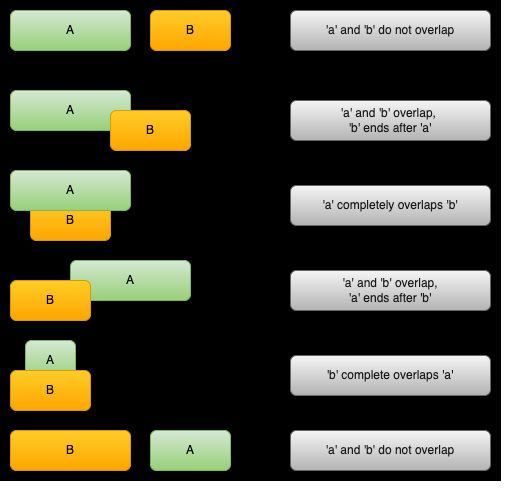

# Merge Intervals

• Efficient technique to deal with overlapping intervals
• frequently, you either need to find overlapping intervals or merge intervals if they overlap. 

The pattern works like this: Given two intervals (‘a’ and ‘b’), there will be six different ways the two intervals can relate to each other:



Understanding and recognizing these six cases will help you help you solve a wide range of problems from `inserting intervals` to `optimizing interval merges`.

### ID the Merge Intervals technique
• produce a list with only mutually exclusive intervals
• If you hear the term “overlapping intervals”.


### Examples of Merge interval problem patterns

<details>
<summary>
<span style="font-size:2rem; color:green;">Intervals Intersection (medium)</span>
</summary>

```js
var intervalIntersection = function(A, B) {

const getIntersection = (a, b) => {
  if(a[1] < b[0] || b[1] < a[0]) return null
  return [Math.max(a[0], b[0]), Math.min(a[1], b[1])]
}

  const result = [];

// get intersection and shift heads (smaller)
  let i =0;
  let j = 0;
  while(i < A.length && j < B.length) {
    const a = A[i];
    const b = B[j];

    const intersection = getIntersection(a,b)

    if(intersection) {
      result.push(intersection)
    }

    // shift the interval with smaller right border
    if(A[i][1] <= B[j][1]){
      i++
    } else {
      j++
    }
  }
  return result
}

// ANOTHER SLIGHTLY DIFFERENT SOLUTION:

var intervalIntersection = function(A, B) {

const getIntersection = (a, b) => {
  if(a[1] < b[0] || b[1] < a[0]) return null
  return [Math.max(a[0], b[0]), Math.min(a[1], b[1])]
}

  const result = [];

// get intersection and shift heads (smaller)
  while(A.length > 0 && B.length > 0) {
    const a = A[0];
    const b = B[0];

    const intersection = getIntersection(a,b)

    if(intersection) {
      result.push(intersection)
    }

    // shift the interval with smaller right border
    if(A[0][1] <= B[0][1]){
      A.shift()
    } else {
      B.shift()
    }
  }
  return result
}
```


</details>


<details>
<summary>
<span style="font-size:2rem; color:green;">Maximum CPU Load (hard)</span>
</summary>

Coming Soon ...


</details>